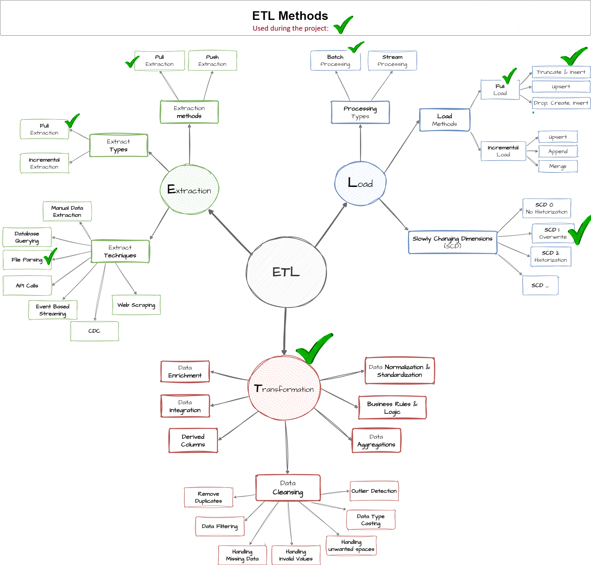

# Data Warehouse and Analytics Project

Welcome to the **Data Warehouse and Analytics Project** repository! 🚀  
This project demonstrates a comprehensive data warehousing and analytics solution, from building a data warehouse to generating actionable insights. Designed as a portfolio project, it highlights industry best practices in data engineering and analytics.

> This project was completed as a guided hands-on exercise under the instruction of **Baraa Al-Sheikh**.  
> The course focused on building an SQL-based data warehouse from scratch, covering end-to-end data engineering practices.

---

## 🏗️ Data Architecture

The data architecture for this project follows Medallion Architecture **Bronze**, **Silver**, and **Gold** layers:

  

1. **Bronze Layer**: Stores raw data as-is from source systems. Data is ingested from CSV files into SQL Server.  
2. **Silver Layer**: Cleansing, standardization, and normalization to prepare data for analysis.  
3. **Gold Layer**: Business-ready data modeled into a star schema for reporting and analytics.

---

## ⚙️ ETL Methods Implemented

  

**Extraction — techniques used**
- **Pull extraction** (scheduled pulls from sources)  
- **Full extraction** (regular full-file loads)  
- **Database querying** (SQL queries on sources)  
- **File parsing (CSV)** (file ingestion & validation)

**Load — approaches used**
- **Processing type: Batch processing**  
- **Full load → Truncate & Insert** (reload target tables)  
- **Slowly Changing Dimensions: SCD Type 1 (Overwrite)** for dimension maintenance

**Transformation — steps used**
- **Data cleansing**: remove duplicates, filtering, handle missing/invalid values, trim unwanted spaces, data type casting, outlier detection  
- **Data normalization & standardization**  
- **Business rules & logic** (apply business validations)  
- **Data aggregations** (metrics and rollups)  
- **Derived columns** (computed attributes)  
- **Data integration** (unifying ERP & CRM sources)  
- **Data enrichment** (contextual enhancements)

---

## 🔄 End-to-End Data Flow

  

---

## 🔗 Data Integration Model

  

---

## ⭐ Star Schema / Business Data Model

  

---

## 📒 Data Catalog (Documentation)

Detailed field descriptions and business definitions are in the catalog:  
➡️ [Data Catalog](docs/data_catalog.md)

---

## 🚀 Project Requirements

### Building the Data Warehouse (Data Engineering)

#### Objective
Develop a modern data warehouse using SQL Server to consolidate sales data, enabling analytical reporting and informed decision-making.

#### Specifications
- **Data Sources**: Import data from two source systems (ERP and CRM) provided as CSV files.  
- **Data Quality**: Cleanse and resolve data quality issues prior to analysis.  
- **Integration**: Combine both sources into a single, user-friendly data model designed for analytical queries.  
- **Scope**: Focus on the latest dataset only; historization of data is not required.  
- **Documentation**: Provide clear documentation of the data model to support both business stakeholders and analytics teams.  

---

## 📊 BI: Analytics & Reporting (Data Analytics)

#### Objective
Develop SQL-based analytics to deliver detailed insights into:  
- **Customer Behavior**  
- **Product Performance**  
- **Sales Trends**  

These insights empower stakeholders with key business metrics for strategic decision-making.

---

