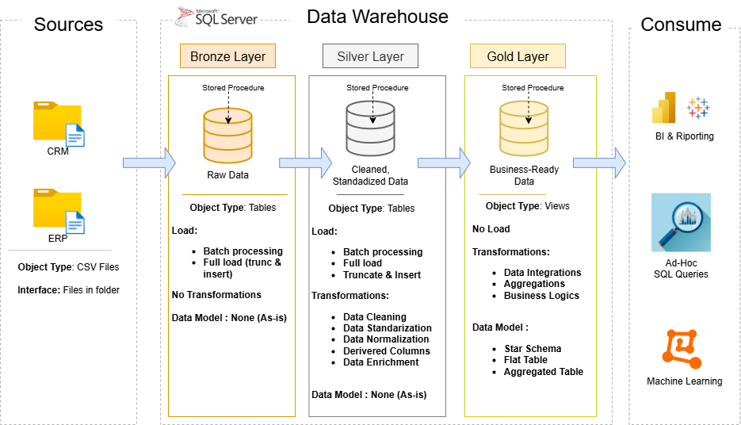
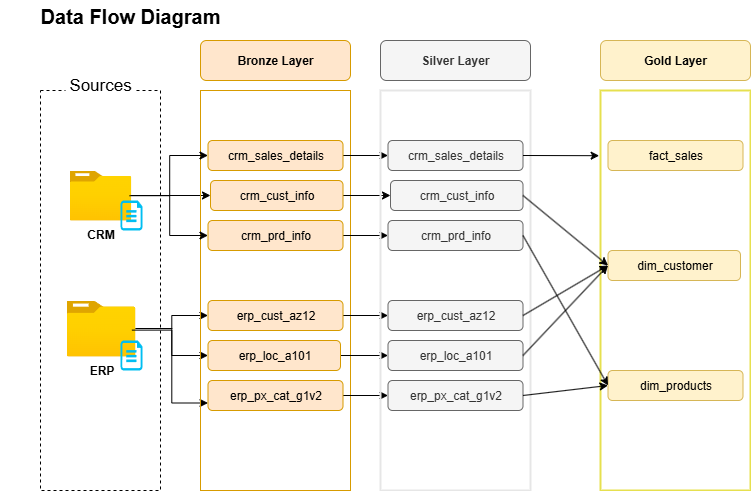
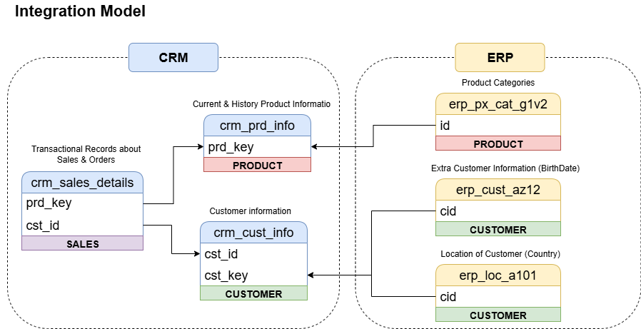
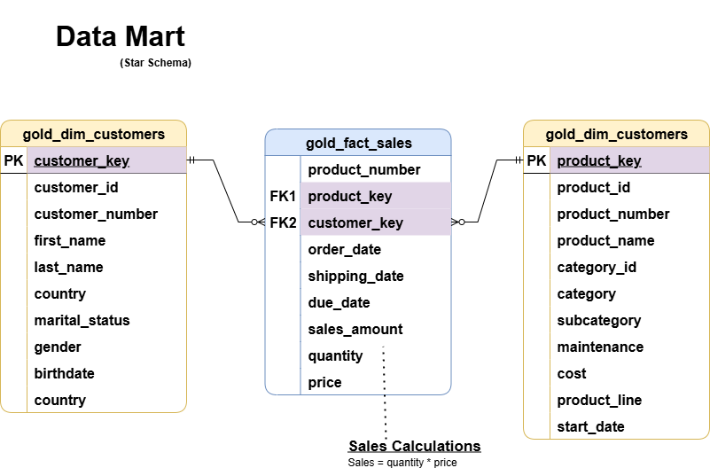

# Data Warehouse and Analytics Project

Welcome to the **Data Warehouse and Analytics Project** repository! 🚀  
This project demonstrates a comprehensive data warehousing and analytics solution, from building a data warehouse to generating actionable insights. Designed as a portfolio project, it highlights industry best practices in data engineering and analytics.

---

## 🏗️ Data Architecture

The data architecture for this project follows Medallion Architecture **Bronze**, **Silver**, and **Gold** layers:

  


1. **Bronze Layer**: Stores raw data as-is from the source systems. Data is ingested from CSV Files into SQL Server Database.  
2. **Silver Layer**: This layer includes data cleansing, standardization, and normalization processes to prepare data for analysis.  
3. **Gold Layer**: Houses business-ready data modeled into a star schema required for reporting and analytics.

---

## 🔄 End-to-End Data Flow

  


---

## 🔗 Data Integration Model

  


---

## ⭐ Star Schema / Business Data Model

  


---

## 📒 Data Catalog (Dokumentáció)

A részletes adatleírások és üzleti definíciók a katalógusban:  
➡️ [Data Catalog](docs/data_catalog.md)


---

## 🚀 Project Requirements

### Building the Data Warehouse (Data Engineering)

#### Objective
Develop a modern data warehouse using SQL Server to consolidate sales data, enabling analytical reporting and informed decision-making.

#### Specifications
- **Data Sources**: Import data from two source systems (ERP and CRM) provided as CSV files.  
- **Data Quality**: Cleanse and resolve data quality issues prior to analysis.  
- **Integration**: Combine both sources into a single, user-friendly data model designed for analytical queries.  
- **Scope**: Focus on the latest dataset only; historization of data is not required.  
- **Documentation**: Provide clear documentation of the data model to support both business stakeholders and analytics teams.  


## 🔧 (Opcionális) SQL minták

<details>
<summary>Kattints az SQL példákhoz (később ide illeszthetők)</summary>

```sql
-- Példa: Silver rétegbeli normalizálás / tisztítás
-- (Ide illesztheted a projektben használt lekérdezéseket.)
